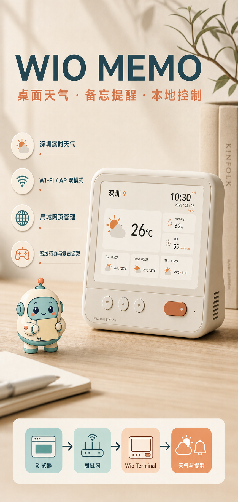
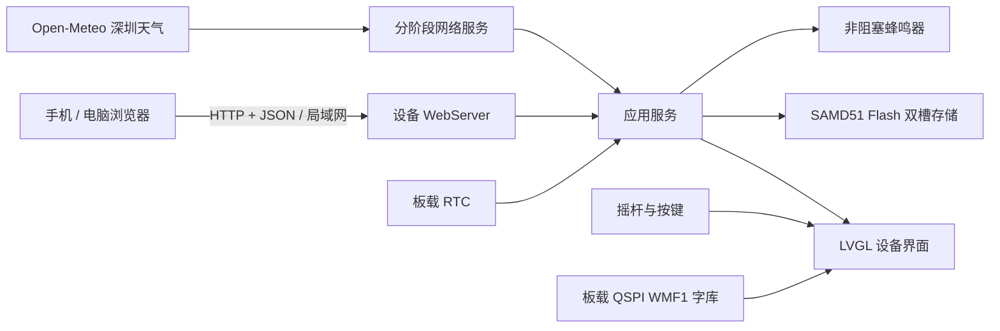

# Wio Memo

> 一台放在桌面上的天气仪表盘、备忘录、会议提醒器和离线小游戏机。



Wio Memo 是基于 [Seeed Studio Wio Terminal](https://wiki.seeedstudio.com/Wio_Terminal_Intro/) 的开源桌面信息终端。它利用设备自带的 320×240 彩屏、五向摇杆、三个按键、Wi‑Fi、RTC、蜂鸣器和板载 QSPI Flash，在不依赖手机 App 或云端账号的情况下提供天气、时间、待办、会议提醒、局域网页管理和复古小游戏。

项目强调三件事：联网时是有产品感的桌面仪表盘，断网时仍可操作，所有配置和日常数据都由用户自己的设备掌控。

## 适合谁

- 希望桌面上有一个不被手机通知打扰的时间与天气入口
- 需要会议开始提醒、日程提示和简单待办管理的办公室用户
- 想学习 Wio Terminal、SAMD51、LVGL、Wi‑Fi WebServer 和嵌入式持久化的开发者
- 喜欢桌面像素设备、电子宠物和复古小游戏的创客
- 希望在内网或离线环境使用轻量信息终端的团队

## 核心功能

### 天气与时间

- 默认展示深圳实时天气、温度、湿度、天气图形和三日预报
- 晴、云、雨、雪、雾、雷雨等天气场景使用 LVGL 动画表现
- 天气响应同步本地日期和时间，写入板载 RTC
- 外网暂不可用时保留深圳默认界面和上一次有效数据
- 蓝白翻页数字时钟与小宠物待机画面

### Wi‑Fi 与本地网页

- 启动时优先连接设备 Flash 中保存的默认 Wi‑Fi
- 连接成功后，状态栏和网络页展示当前 SSID、设备 IP 和网页地址
- 连接失败后自动开启设备热点，固定地址为 `http://192.168.5.1/`
- 设备菜单可在“连接已保存 Wi‑Fi / 开启设备热点 / 离线”之间切换
- Web 页面也提供保存并连接、连接已保存网络、开启热点和离线按钮
- Web 端可扫描附近 Wi‑Fi，配置 STA 名称/密码、AP 名称/密码和时区
- 手机或电脑只要与设备处于同一局域网，即可直接访问，无需云服务

### 待办与会议提醒

- Web 端新增、编辑、完成和删除待办或会议
- 最多保存 12 条事项，支持准时或提前 5/10/30 分钟提醒
- 事项写入设备 Flash，断网、重启后仍然存在
- 到点后通过板载蜂鸣器播放非阻塞提示音
- 提醒事件带持久化标记，设备重启不会反复播放旧提醒

### 设备 UI

- 基于 LVGL 8.3 的 320×240 原生界面
- 暖白、青绿、橙色的简约桌面产品风格
- 五向摇杆支持上下左右导航，按下确认
- 顶部状态条展示 Wi‑Fi、AP、连接中或离线状态
- 板载 QSPI Flash 保存 12/16/20 像素中文 WMF1 字库，不依赖 SD 卡
- 分块刷新和非阻塞动画，避免整屏闪烁

### 离线复古小游戏

- 点灯谜题
- 记忆翻牌
- 打砖块
- 俄罗斯方块

网络不可用时，菜单、天气默认页、待机动画、任务浏览和小游戏仍可使用。

## 产品模式

| 模式 | 设备行为 | 如何访问网页 |
| --- | --- | --- |
| 局域网 STA | 连接已保存 Wi‑Fi，获取天气并同步时间 | 打开屏幕网络页显示的 `http://设备IP/` |
| 设备热点 AP | 建立独立热点和配置门户 | 连接热点后打开 `http://192.168.5.1/` |
| 离线 | 关闭网络，保留本地 UI、任务、提醒和游戏 | 不提供网页 |

首次使用若没有保存 Wi‑Fi，设备会自动进入 AP 模式。热点的初始名称和密码定义在 `DeviceSettings` 默认值中，也可通过网页修改。

## 系统架构



代码按职责分层：

- `domain`：任务实体、状态和容量约束
- `application`：任务排序、替换、提醒判定和时间策略
- `infrastructure`：CRC32、双槽持久化、QSPI 字库
- `presentation`：LVGL UI、LCD 刷新、字形适配、蜂鸣器、内嵌网页
- `main.cpp`：硬件组合根、Wi‑Fi/AP 状态机、Web API、天气和主循环调度

## 网络设计

Wio Terminal 的 rpcWiFi DNS 调用可能长时间阻塞。当前版本采用以下策略保证 UI 和网页优先响应：

1. Wi‑Fi/AP 切换拆成“关闭旧模式 → 等待无线核心稳定 → 启动新模式”三个阶段。
2. Wi‑Fi 连接过程不阻塞 LVGL；10 秒内未连上即自动回退 AP。
3. 深圳天气使用明确坐标和短连接/读取超时。
4. 天气响应同时校准 RTC，避免启动时再发起一条阻塞式 NTP DNS 请求。
5. 天气失败后延迟重试，不在主循环连续请求。

## Web API

| 方法 | 路径 | 说明 |
| --- | --- | --- |
| `GET` | `/api/device` | 网络、IP、时间、天气和配置状态 |
| `GET` | `/api/wifi/scan` | 扫描附近 Wi‑Fi |
| `PUT` | `/api/network` | 保存 STA/AP/时区配置并连接 |
| `PUT` | `/api/network/mode` | 切换 `station`、`ap` 或 `offline` |
| `GET` | `/api/tasks` | 获取事项列表 |
| `PUT` | `/api/tasks` | 整体同步事项列表 |

管理页运行在局域网 HTTP 上，没有账号和 TLS。请仅在可信网络中使用，不要直接暴露到公网。

## 硬件与技术栈

- Seeed Studio Wio Terminal
- ATSAMD51P19A，120 MHz，192 KB RAM
- RTL8720DN Wi‑Fi 协处理器
- 2.4 英寸 320×240 LCD
- Arduino / PlatformIO
- LVGL 8.3.11
- rpcWiFi、WebServer、ArduinoJson
- FlashStorage_SAMD 双槽 CRC 持久化
- 板载 QSPI Flash 中文字库

## 快速开始

### 1. 准备 PlatformIO

使用 VS Code PlatformIO 扩展，或项目内 Python 虚拟环境：

```powershell
.\.venv\Scripts\pio.exe --version
```

### 2. 配置开发时默认 Wi‑Fi（可选）

复制 `include/secrets.example.h` 为 `include/secrets.h` 并填写本地网络。该文件已被 `.gitignore` 排除，不会提交到仓库。

```cpp
#define WIFI_SSID "your-wifi-name"
#define WIFI_PASSWORD "your-wifi-password"
#define LOCAL_UTC_OFFSET_MINUTES 480
#define WIFI_FORCE_PROVISION 0
```

也可以完全不创建该文件：首次启动进入设备热点后，在 `192.168.5.1` 的 Web 页面配置 Wi‑Fi。

### 3. 安装中文字体

项目已包含生成好的 WMF1 字库。先让设备进入下载模式，然后执行：

```powershell
.\.venv\Scripts\pio.exe run -e font_installer -t upload
```

字体布局、重新生成和串口校验流程见 [assets/fonts/README.md](assets/fonts/README.md) 与 [docs/05-font-workflow.md](docs/05-font-workflow.md)。

### 4. 编译与上传主固件

```powershell
.\.venv\Scripts\pio.exe run -e seeed_wio_terminal
.\.venv\Scripts\pio.exe run -e seeed_wio_terminal -t upload
```

### 5. 测试

```powershell
.\.venv\Scripts\pio.exe test -e native
node scripts/check_embedded_web.js
```

## 项目结构

```text
assets/
  fonts/                    OTF 与 WMF1 中文字库
  marketing/                项目宣传海报
  ui/                       小宠物与界面资源
docs/                       PRD、UI、架构和交付文档
include/wio_memo/
  application/              应用层接口
  domain/                   任务领域模型
  infrastructure/           存储与字库接口
  presentation/             UI、蜂鸣器、Web 页面接口
src/
  application/              任务和提醒实现
  infrastructure/           CRC、持久化、QSPI 字库
  presentation/             LVGL、LCD、字体、游戏和小宠物
  main.cpp                   网络、天气、Web API、主调度
test/test_core/              本机单元测试
tools/                       字体打包与资源转换工具
```

## 当前资源占用

以 `seeed_wio_terminal` Release 环境编译：

- RAM：约 61%
- Flash：约 90%

因此新增功能时需要控制静态图片、字体和 TLS 依赖体积。大字库放在 QSPI Flash，而不是占用主程序 Flash。

## 设计文档

- [产品需求 PRD](docs/01-prd.md)
- [设备 UI 规范](docs/02-ui-spec.md)
- [系统架构](docs/03-architecture.md)
- [交付计划](docs/04-delivery-plan.md)
- [字库工作流](docs/05-font-workflow.md)
- [离线 LVGL UI](docs/06-offline-lvgl-ui.md)

## 隐私与安全

- Wi‑Fi 密码保存在设备 Flash，不写入 Git 仓库
- 天气请求只发送城市坐标，不上传待办和会议内容
- 待办、会议与设置均保存在本机设备
- 项目不依赖第三方账号或云数据库

## 路线图

- Web 端城市与经纬度配置
- 更可靠的 AQI HTTPS 数据源
- OTA 固件升级
- 更多宠物状态与天气联动动画
- 任务分类、重复提醒和日历导入
- 更多低内存复古小游戏

## License

项目代码采用 [MIT License](LICENSE)。字体使用 Noto Sans CJK SC，许可证见 [assets/fonts/OFL-LICENSE.txt](assets/fonts/OFL-LICENSE.txt)。
