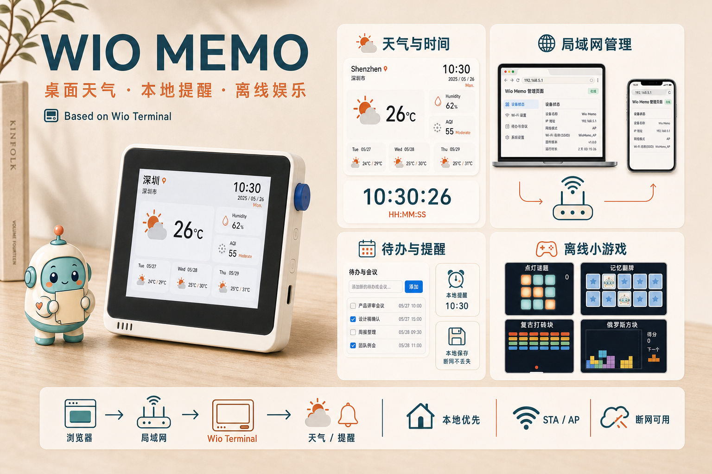
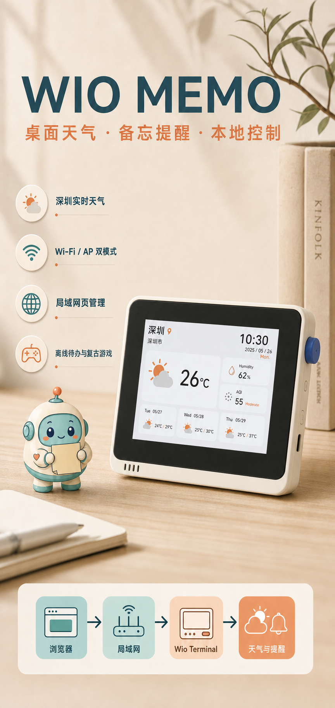
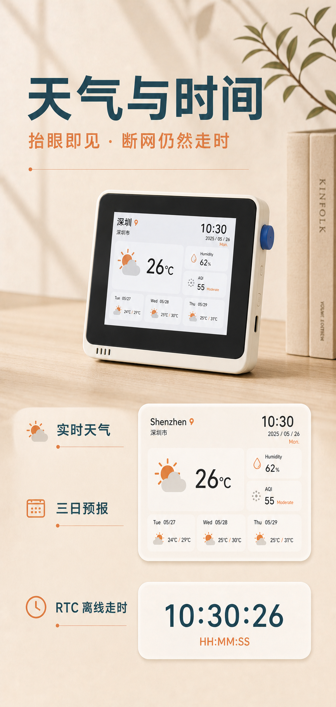
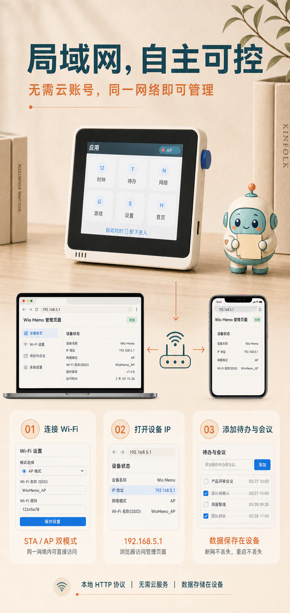
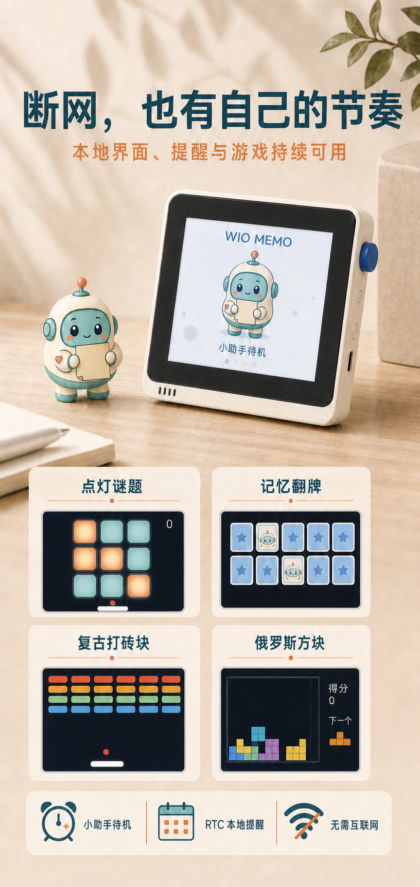
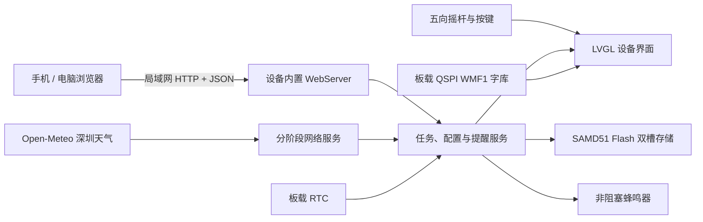

# Wio Memo

> 基于 Seeed Studio Wio Terminal 的本地优先桌面信息终端：天气、时钟、待办提醒、局域网页面与离线小游戏。

<p align="center">
  
</p>

> 宣传图依据实机照片重新渲染，设备采用 Wio Terminal 的真实结构与比例，不是量产产品照片；屏幕数值用于版式展示。项目当前是可编译、可烧录的开源原型。

## 四页产品画册

<table>
  <tr>
    <td width="50%"></td>
    <td width="50%"></td>
  </tr>
  <tr>
    <td width="50%"></td>
    <td width="50%"></td>
  </tr>
</table>

## 项目简介

Wio Memo 把 Wio Terminal 做成一台无需云账号的桌面小终端。设备可以连接已有 Wi‑Fi，也能自行开启 AP 热点；手机或电脑只要和设备处于同一局域网，就能打开设备内置网页管理网络与事项。互联网不可用时，设备端菜单、已保存事项、RTC 时间、提醒逻辑和小游戏仍可工作。

这个项目的重点不是把所有功能塞进 320×240 屏幕，而是让设备承担“持续可见、及时提醒、快速确认”，把文字录入和网络配置留给浏览器。

## 当前能够做什么

### 天气与时间

- 首页默认展示 `Shenzhen / 深圳市`，提供深圳离线预览。
- 连接互联网后，以深圳固定坐标请求 Open‑Meteo 当前天气及未来三天预报。
- 当前天气请求会解析温度、湿度、天气代码、风速和三日高低温；首页展示温度、湿度、天气场景和三日预报。AQI 位置已预留，但当前稳定链路尚未启用实时 AQI 请求。
- 天气请求成功后使用响应时间校准板载 RTC；断网后由 RTC 继续计时。
- 独立时钟页采用与天气首页一致的暖白、橙色卡片风格，显示 `HH:MM:SS`。
- 晴、多云、雨、雪、雾、雷雨等场景使用 LVGL 图形与轻量动画表达。

当前版本以“深圳桌面天气仪表盘”为明确默认产品形态。IP 定位代码仍属于实验性能力，没有作为默认流程启用，因此不应把当前版本描述为自动定位天气设备。

### Wi‑Fi、AP 与本地网页

- 启动时优先连接设备 Flash 中保存的 Wi‑Fi。
- 未配置网络或连接失败时可开启设备热点；热点管理地址为 `http://192.168.5.1/`。
- STA 模式下，网络页显示当前 SSID、设备局域网 IP 和访问地址。
- Web 页面支持扫描附近 Wi‑Fi、保存 STA/AP 配置、切换 STA/AP/离线模式。
- Web 页面支持新增待办或会议、完成事项、删除事项和整表同步，最多保存 12 条。
- 所有页面和 API 直接运行在设备上，不依赖云服务器。

局域网管理端使用普通 HTTP，没有账号体系和 TLS。它只适合可信内网，不应通过端口映射直接暴露到公网。

### 设备界面与交互

- 基于 LVGL 8.3.11 的 320×240 原生界面。
- 暖白、青绿、珊瑚橙配色，圆角卡片与局部刷新。
- 启动画面和待机画面包含 Wio Memo 小助手。
- 五向摇杆支持上下左右导航，按下确认；顶部按键提供菜单、返回和快捷操作。
- 状态栏和网络页区分连接中、STA、AP 与离线状态。
- 中文字形由板载 4 MB QSPI Flash 中的 WMF1 字库提供，不需要 SD 卡。

### 提醒与离线娱乐

- 支持待办/会议、开始时间和提前 0/5/10/30 分钟提醒。
- 提醒状态持久化，避免重启后反复播放同一个旧提醒。
- 板载蜂鸣器使用非阻塞节拍播放提示音，可静音。
- 内置点灯谜题、记忆翻牌、打砖块和俄罗斯方块，均可离线运行。

## 产品模式

| 模式 | 设备行为 | 网页访问方式 |
| --- | --- | --- |
| 局域网 STA | 连接已保存 Wi‑Fi，获取深圳天气并更新时间 | 打开网络页显示的 `http://设备IP/` |
| 设备热点 AP | 建立独立热点，提供配网和本地管理入口 | 连接热点后打开 `http://192.168.5.1/` |
| 离线 | 关闭无线网络，保留设备 UI、RTC、已保存事项、提醒和游戏 | 不提供网页 |

## 已验证与仍需验证

已完成的工程验证：

- `seeed_wio_terminal` Release 固件编译通过。
- native 核心测试 7/7 通过：CRC、任务排序、状态保留、提醒去重、旧事件、Snooze 和时区策略。
- 嵌入式网页脚本具备独立语法检查脚本。
- 已在实机上验证过局域网 HTTP 页面、`/api/device` 状态接口、RTC 更新时间和深圳天气响应。
- 当前固件约使用 61% RAM、90% 主程序 Flash；中文字体单独存放在 QSPI Flash。

仍需继续完成的产品级验证：

- 最新界面提交需要再次写入实机并逐页拍照验收。
- AP/STA 反复切换、错误密码、路由器断线与长时间运行仍需形成完整回归记录。
- AQI 实时数据、自动城市定位、Web 鉴权、OTA 和日历导入尚未完成。
- 当前 Web 端不提供复杂的逐项编辑、重复任务、附件或多用户协作。

## 系统架构



当前默认运行采用协作式主循环：UI、Web、无线状态机和天气请求按阶段执行。这是针对 Wio Terminal `rpcWiFi` 行为做出的稳定性选择。仓库中保留 FreeRTOS UI/网络双任务路径，但默认未启用，不能把当前版本描述为已经依赖多任务运行。

代码按职责划分：

- `domain`：任务实体、状态和容量约束。
- `application`：排序、替换、提醒判定和时间策略。
- `infrastructure`：CRC32、双槽持久化和 QSPI 字库。
- `presentation`：LVGL UI、LCD 适配、字体、蜂鸣器、小宠物和内嵌网页。
- `main.cpp`：硬件组合、无线状态机、Web API、天气请求与主循环调度。

## Web API

| 方法 | 路径 | 当前用途 |
| --- | --- | --- |
| `GET` | `/api/device` | 网络、IP、时间、天气与配置状态 |
| `GET` | `/api/wifi/scan` | 扫描附近 Wi‑Fi |
| `PUT` | `/api/network` | 保存 STA/AP/时区配置并尝试连接 |
| `PUT` | `/api/network/mode` | 切换 `station`、`ap` 或 `offline` |
| `GET` | `/api/tasks` | 获取事项列表 |
| `PUT` | `/api/tasks` | 校验并整体替换事项列表 |

## 硬件与技术栈

- Seeed Studio Wio Terminal
- ATSAMD51P19A，120 MHz，192 KB RAM
- RTL8720DN 无线协处理器
- 2.4 英寸 320×240 LCD、五向摇杆、三枚按键、蜂鸣器与 RTC
- Arduino / PlatformIO
- LVGL 8.3.11、TFT_eSPI、rpcWiFi、WebServer、ArduinoJson
- FlashStorage_SAMD 双槽 CRC 持久化
- 板载 QSPI Flash 中的 12/16/20 px 中文 WMF1 字库

## 快速开始

### 1. 检查 PlatformIO

```powershell
.\.venv\Scripts\pio.exe --version
```

也可以使用 VS Code 中的 PlatformIO 扩展。

### 2. 可选：设置开发时默认 Wi‑Fi

复制 `include/secrets.example.h` 为 `include/secrets.h`，填写本地网络。该文件已被 `.gitignore` 排除，不应提交。

```cpp
#define WIFI_SSID "your-wifi-name"
#define WIFI_PASSWORD "your-wifi-password"
#define LOCAL_UTC_OFFSET_MINUTES 480
#define WIFI_FORCE_PROVISION 0
```

不创建该文件也可以：设备进入 AP 后，通过 `192.168.5.1` 配置网络。

### 3. 安装中文字体

仓库已包含约 934 KiB 的 12/16/20 px WMF1 字库包。设备进入下载模式后执行：

```powershell
.\.venv\Scripts\pio.exe run -e font_installer -t upload
python tools\font_upload.py --port COM5 --file assets\fonts\wio-memo-font-bundle.wmf
```

将 `COM5` 替换为实际串口。详细说明见 [字体工作流](docs/05-font-workflow.md)。

### 4. 编译与上传主固件

```powershell
.\.venv\Scripts\pio.exe run -e seeed_wio_terminal
.\.venv\Scripts\pio.exe run -e seeed_wio_terminal -t upload
```

### 5. 测试

```powershell
.\.venv\Scripts\pio.exe test -e native
node scripts\check_embedded_web.js
```

## 项目结构

```text
assets/
  fonts/                    OTF 与 WMF1 中文字库
  marketing/                横向/纵向宣传渲染图
  ui/                       小助手与界面资源
docs/                       状态、PRD、UI、架构与交付文档
include/wio_memo/            分层接口与领域模型
src/                         固件实现
test/test_core/              本机核心测试
tools/                       字体打包与上传工具
```

## 设计文档

- [当前实现状态](docs/00-current-status.md)
- [产品需求 PRD](docs/01-prd.md)
- [设备与 Web UI 规范](docs/02-ui-spec.md)
- [系统架构](docs/03-architecture.md)
- [交付与验证计划](docs/04-delivery-plan.md)
- [板载 QSPI 字体工作流](docs/05-font-workflow.md)
- [离线优先与 LVGL UI](docs/06-offline-lvgl-ui.md)

## 隐私与安全边界

- STA/AP 密码保存在设备配置存储中，不写入 Git 仓库。
- STA 密码不会由状态接口返回；当前网络页为了显示热点凭据，会通过可信局域网接口读取 AP 密码。这是原型阶段的已知安全边界。
- 当前天气请求只发送深圳坐标，不上传待办和会议内容。
- 待办、会议与设置保存在本机设备，不依赖第三方账号或云数据库。
- 内置管理页没有 TLS 与登录鉴权，仅用于可信局域网。

## 路线图

- 可配置城市与可靠的 IP/手动定位流程。
- 独立、低阻塞的 AQI 数据更新。
- Web 逐项编辑、重复提醒和日历导入。
- AP/STA 长稳回归、看门狗和故障恢复记录。
- Web 本地访问口令与 OTA 升级。
- 在资源预算内继续优化界面动画和小游戏。

## License

项目代码采用 [MIT License](LICENSE)。中文字体使用 Noto Sans CJK SC，许可见 [OFL-LICENSE.txt](assets/fonts/OFL-LICENSE.txt)。
