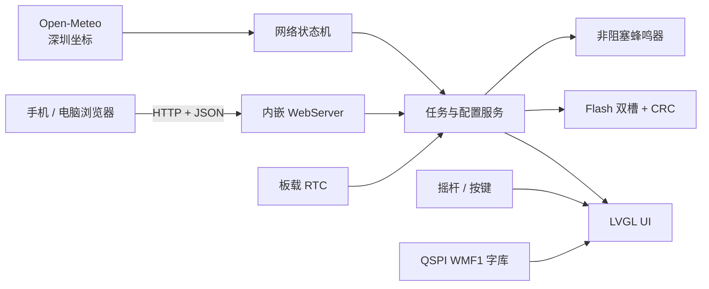
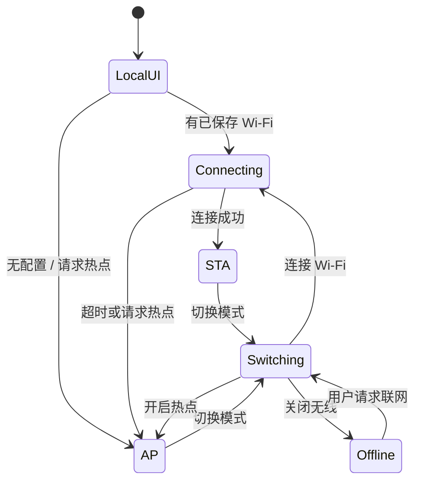

# Wio Memo 系统架构

## 1. 架构定位

Wio Memo 采用 Local-first 单设备架构。Wio Terminal 同时承担显示、输入、提醒、数据存储和局域网 HTTP 服务；互联网仅用于天气与时间更新。断网不应破坏设备端核心能力。

中文字库放在板载 4 MB QSPI Flash，不要求 SD 卡。任务、网络设置和提醒标记使用 SAMD51 Flash 持久化。

## 2. 运行组成



## 3. 代码分层

| 层 | 目录 | 责任 |
| --- | --- | --- |
| Domain | `include/wio_memo/domain` | Task、状态、容量和提醒标记 |
| Application | `src/application` | 排序、替换、提醒判定、Snooze 与时间策略 |
| Infrastructure | `src/infrastructure` | CRC32、Flash 双槽、QSPI 字库 |
| Presentation | `src/presentation` | LVGL 页面、LCD 端口、字体适配、蜂鸣器与游戏 |
| Composition | `src/main.cpp` | 硬件初始化、Wi‑Fi/AP、Web API、天气和运行调度 |

当前 Web 页面以内嵌字符串形式位于 presentation 接口中，没有独立的前端构建产物。

## 4. 默认调度模型

当前默认构建设置 `SAFE_UI_ONLY_MODE = true`，采用协作式主循环：

```text
loop
 ├─ 处理按键、LVGL、提醒与蜂鸣器
 ├─ 推进 STA/AP/离线切换状态机
 ├─ 处理一小步 Web/DNS 请求
 ├─ 到期时推进天气请求阶段
 └─ 更新只读网络快照
```

仓库保留 FreeRTOS `uiTask` 与 `networkTask` 路径以及 SysTick 转发代码，但默认没有启用。此前实机在无线切换和任务调度组合下出现过卡死，因此当前稳定策略优先减少并发复杂度。只有完成系统回归后，才能重新评估双任务路径。

## 5. 网络状态机



无线切换采用“停止旧模式 → 等待芯片稳定 → 启动新模式”的分阶段过程。连接超时约 10 秒；整个过程中 UI 主循环继续运行。

AP 地址固定为 `192.168.5.1`，并处理常见 Portal 探测路径。STA 成功后网页地址由 DHCP 分配的设备 IP 决定。

## 6. 天气与时间

- 默认城市：深圳。
- 默认坐标：约 `22.5431, 114.0579`。
- 数据源：Open‑Meteo forecast API。
- 刷新：成功后约 30 分钟；失败后约 5 分钟重试。
- 展示：当前温度、湿度、天气代码、风速与未来三天高低温。
- 校时：forecast 响应中的本地时间用于调整 RTC。
- IP 定位和 AQI 函数存在，但默认稳定流程尚未启用。

为规避 `rpcWiFi` DNS 长阻塞，forecast 请求当前使用已知 IPv4 地址并显式发送 `Host` 头。这一做法需要持续关注上游地址变化，不应视为长期理想方案。

## 7. 存储设计

- 任务与设备配置使用带 schema、sequence 与 CRC32 的逻辑双槽。
- 新数据校验成功后才成为最新有效槽。
- 最多保存 12 条任务，标题最多 48 个 UTF‑8 字节。
- 提醒触发标记随任务持久化，避免重启重放。
- STA 密码不会通过状态 API 返回，也不会写入 Git；当前 AP 密码会通过 `/api/device` 返回给本地网络页，这是需要在后续鉴权设计中修正的原型安全边界。
- 高频 UI 状态只保存在 RAM。

## 8. 字体与显示

QSPI 字体包包含 12、16、20 px 三套 WMF1 字库，总大小约 956,130 字节。每套包含 7,445 个字符，设备以 UTF‑8 解码、Unicode 二分查找和 LVGL 字体回调按需取字。

LVGL 使用局部缓冲与脏矩形刷新，不分配完整 320×240 RGB565 帧缓冲。UI 页面切换时重建设备对象；持续动画限制在小区域。

## 9. 当前 API

| 方法 | 路径 | 说明 |
| --- | --- | --- |
| `GET` | `/api/device` | 网络、IP、时间、天气和设置状态 |
| `GET` | `/api/wifi/scan` | 扫描附近网络 |
| `PUT` | `/api/network` | 保存 STA/AP/时区并计划连接 |
| `PUT` | `/api/network/mode` | 切换 `station` / `ap` / `offline` |
| `GET` | `/api/tasks` | 读取全部任务 |
| `PUT` | `/api/tasks` | 校验并替换全部任务 |

API 当前没有版本前缀、鉴权和 TLS。带 `/api/v1` 的 REST 设计属于后续演进方案，不是现有接口。

## 10. 资源与风险

- 最近 Release 构建约占 61% RAM、90% 主程序 Flash。
- QSPI 字库不占用主程序 Flash，但初始化和字形缓存会消耗 RAM/总线时间。
- 主要风险是 `rpcWiFi` 阻塞、模式切换、固定 forecast IP、Flash 容量余量和缺少长期运行记录。
- 新功能优先通过删除重复资源、压缩字符串和减少依赖获得空间，不直接叠加大型库。
